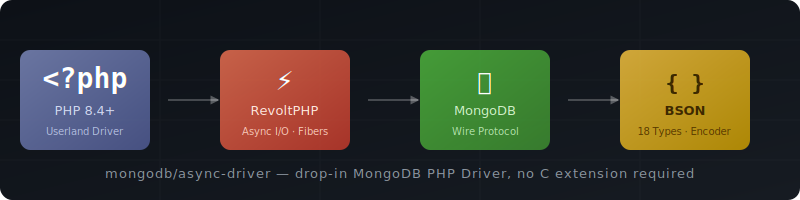

# mongodb-driver-revoltphp



A pure userland PHP 8.4+ MongoDB driver that provides the same `MongoDB\Driver\*` and `MongoDB\BSON\*` namespaces as the `ext-mongodb` C extension, but implemented entirely in PHP using [RevoltPHP](https://revolt.run) for async I/O.

## Why

- **No C extension required** — works in environments where you cannot install PHP extensions (some PaaS platforms, restricted containers, etc.).
- **Async-first** — network I/O is non-blocking via [amphp/socket](https://github.com/amphp/socket). In a Revolt/Amp application every MongoDB operation suspends only the calling fiber, not the entire process.
- **Drop-in compatible** — exposes the same classes and method signatures as `ext-mongodb`, so the official [mongodb/mongodb](https://github.com/mongodb/mongodb-php-library) library works on top of it unchanged.

## Requirements

| Requirement | Version |
|---|---|
| PHP | 8.4+ |
| MongoDB server | 4.0+ (wire protocol v7+) |
| revolt/event-loop | ^1.0 |
| amphp/amp | ^3.0 |
| amphp/socket | ^2.0 |

## Installation

> **Note:** `ext-mongodb` must **not** be loaded at the same time. See [Disabling ext-mongodb](#disabling-ext-mongodb).

```bash
composer require mongodb/mongodb-driver-revoltphp
```

If you also want the high-level `MongoDB\Client` / `Collection` / `Database` API, install the official library on top:

```bash
composer require mongodb/mongodb
```

## Quick start

```php
<?php
require 'vendor/autoload.php';

use MongoDB\Driver\Manager;
use MongoDB\Driver\Command;
use MongoDB\Driver\Query;
use MongoDB\Driver\BulkWrite;

$manager = new Manager('mongodb://127.0.0.1:27017');

// Ping
$cursor = $manager->executeCommand('admin', new Command(['ping' => 1]));
var_dump($cursor->toArray()); // [{"ok": 1}]

// Insert
$bulk = new BulkWrite();
$id = $bulk->insert(['name' => 'Alice', 'age' => 30]);
$manager->executeBulkWrite('mydb.users', $bulk);

// Query
$cursor = $manager->executeQuery('mydb.users', new Query(['name' => 'Alice']));
foreach ($cursor as $doc) {
    echo $doc->name; // Alice
}
```

## Async usage (Revolt / Amp)

Inside a Revolt fiber each operation suspends only the current fiber while the event loop continues:

```php
use Amp\async;
use function Revolt\EventLoop\run;

run(function () {
    $manager = new Manager('mongodb://127.0.0.1:27017');

    // Run two queries concurrently
    $f1 = async(fn() => $manager->executeQuery('db.col', new Query(['x' => 1]))->toArray());
    $f2 = async(fn() => $manager->executeQuery('db.col', new Query(['y' => 2]))->toArray());

    [$r1, $r2] = [$f1->await(), $f2->await()];
});
```

## Disabling ext-mongodb

The extension and this library define the same class names and cannot both be active at once. Composer enforces this via `"conflict": {"ext-mongodb": "*"}`.

### CI / Docker

Simply don't install the extension (the default on most base images):

```yaml
- uses: shivammathur/setup-php@v2
  with:
    php-version: '8.4'
    extensions: intl, mbstring   # no 'mongodb' here
```

### Local development

The extension is typically loaded via a file in PHP's `conf.d` scan directory. Bypass it for a single command with:

```bash
PHP_INI_SCAN_DIR="" php my-script.php
```

To make this permanent for the project, add `PHP_INI_SCAN_DIR=""` to your shell profile or a `.env` file loaded by your test runner.

## Architecture

```
src/
├── BSON/                    MongoDB\BSON\* types (ObjectId, Binary, UTCDateTime, …)
├── Driver/                  MongoDB\Driver\* public API (Manager, Cursor, BulkWrite, …)
│   ├── Exception/           Exception hierarchy
│   └── Monitoring/          APM subscriber interfaces and events
├── Internal/
│   ├── Auth/                SCRAM-SHA-256 / SCRAM-SHA-1 authentication
│   ├── BSON/                Binary BSON encoder + decoder, Extended JSON
│   ├── Connection/          Async TCP connection + connection pool (amphp/socket)
│   ├── Operation/           Command executor, query builder, bulk write runner
│   ├── Protocol/            OP_MSG wire-protocol framing (encode/decode)
│   ├── Session/             Server session pool
│   ├── Topology/            SDAM state machine, server monitors, server selector
│   └── Uri/                 MongoDB connection string parser
└── bootstrap.php            Registers global Monitoring functions
```

### Key design decisions

| Concern | Approach |
|---|---|
| Async runtime | RevoltPHP event loop; fibers suspend during I/O |
| Sync compatibility | `SyncRunner::run()` wraps async ops in `EventLoop::run()` when called from non-fiber context |
| BSON int64 | Decoded as native PHP `int` (matching 64-bit ext-mongodb behaviour); `MongoDB\BSON\Int64` is only used when constructing or encoding values explicitly |
| Authentication | SCRAM-SHA-256 by default; SCRAM-SHA-1 fallback based on `saslSupportedMechs` |
| Topology | Background fiber per seed host; SDAM spec state machine |
| Connection pool | Per-server `SplQueue` of idle connections; fiber-suspending waiters when pool is full |

## Running tests

> **Note:** `ext-mongodb` must **not** be active when running tests (classes would conflict). Check with `php --ri mongodb`.

```bash
# Unit tests (no MongoDB required)
./vendor/bin/phpunit --testdox --testsuite unit

# Integration tests (requires MongoDB on localhost:27017)
./vendor/bin/phpunit --testdox --testsuite integration

# ext-mongodb phpt compatibility tests
tests/run-phpt.sh

# Official mongodb/mongodb library tests (use run-phpunit.sh to inject MONGODB_URI)
tests/run-phpunit.sh mongodb://127.0.0.1:PORT/ \
    -c tests/references/mongo-php-library/phpunit.xml.dist \
    tests/references/mongo-php-library/tests/

# Run a subset of library tests
tests/run-phpunit.sh mongodb://127.0.0.1:PORT/ \
    -c tests/references/mongo-php-library/phpunit.xml.dist \
    tests/references/mongo-php-library/tests/ --filter testCrud
```

## Supported features

- [x] `MongoDB\Driver\Manager` — connect, execute commands/queries/bulk writes
- [x] `MongoDB\Driver\Cursor` — iterate, `toArray()`, lazy `getMore`
- [x] `MongoDB\Driver\BulkWrite` — insert, update, delete
- [x] `MongoDB\Driver\ReadPreference` / `WriteConcern` / `ReadConcern`
- [x] `MongoDB\Driver\Session` — logical sessions with `lsid` propagation
- [x] `MongoDB\Driver\ServerDescription` / `TopologyDescription`
- [x] `MongoDB\BSON\*` — all 18 BSON types
- [x] SCRAM-SHA-256 and SCRAM-SHA-1 authentication
- [x] Replica set discovery and monitoring (SDAM)
- [x] Connection pooling
- [x] APM command monitoring (`CommandSubscriber`)
- [x] SDAM monitoring (`SDAMSubscriber`)
- [x] Log subscribers (`LogSubscriber` / `mongoc_log()`)
- [x] Change streams (via `aggregate` with `$changeStream` stage)
- [x] Persistable / Unserializable BSON deserialization
- [x] Non-genuine host warnings (CosmosDB / DocumentDB detected at connect time)

## Unsupported features

The following features from `ext-mongodb` are **not yet implemented**:

| Feature | Notes |
|---|---|
| **Multi-document transactions** | `Session::startTransaction()` / `commitTransaction()` / `abortTransaction()` are stubs |
| **Client-side field level encryption (CSFLE)** | `ClientEncryption` class exists but encryption is not wired up |
| **Queryable Encryption (QE)** | Not implemented |
| **Wire compression** | `zlib`, `snappy`, and `zstd` compressors are not supported |
| **Persistent clients** | Each `Manager` instance creates independent connections; there is no cross-request connection persistence like in the C extension |
| **GSSAPI / Kerberos authentication** | SCRAM-SHA-256 and SCRAM-SHA-1 are implemented; GSSAPI is not |
| **LDAP (PLAIN) authentication** | Not implemented |
| **X.509 authentication** | Not implemented |
| **AWS authentication** | Not implemented |
| **Stable API versioning** | `serverApi` URI / constructor option is parsed but not sent in commands |
| **Snapshot sessions** | `Session` objects do not support snapshot read concern |
| **`MongoDB\Driver\BulkWrite::delete` with `hint`** | `hint` is accepted but the server may reject it on older versions |
| **APM event filtering by operation type** | All commands are monitored; no exclude-list support |
| **`Int64` arithmetic comparison** | In PHP 8.5+, `Int64 == 0` may emit a notice; use `(string) $id === '0'` instead |

## License

Apache-2.0 — see [LICENSE](LICENSE).
